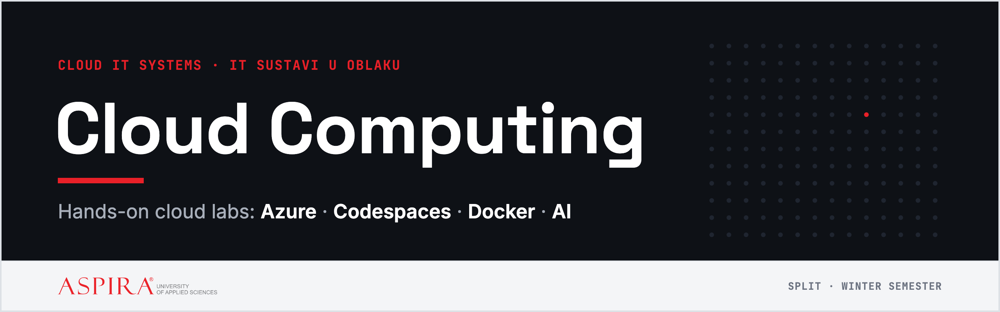

  

  

  
  
  
  
  

Lab environment for **IT sustavi u oblaku / Cloud IT Systems** at Aspira University of Applied Sciences, Split.
Every lab's instructions live here, and Merlin links straight to them. You **submit on Merlin**.

## 🚀 How a lab works

| # | Do this | Details |
|:-:|---|---|
| **1** | Open this week's lab in the table below | The instructions live here; Merlin links to this page, so it's always the current version. |
| **2** | Work where the lab tells you to | Container labs run in **GitHub Codespaces** (button above). Azure labs run in **Azure Cloud Shell**. Both are in your browser. Use the copy button on each code block. |
| **3** | Submit your report on Merlin | Each lab tells you exactly what goes in: your own data, screenshots and short answers. You can finish a lab at home and submit any time, but all labs must be in before the first exam period. |

> [!TIP]
> **Get an email when a new lab is out:** **Watch → Custom → Releases** (top right). **⭐ Star** the repo to keep it in your bookmarks.

> [!TIP]
> When a lab asks you to **save your work** in a codespace, fork the repo first (top right → **Fork**) and open the codespace from *your* fork. When new labs appear here, update your fork with **Sync fork → Update branch**.

## 🧪 Labs

| # | Lab | Runs on | Notes |
|:-:|---|---|---|
| 00 | [Set up your cloud](lab-00-setup/README.md) | GitHub Codespaces · Azure for Students | at home: Part A before Lab 01, Part B before Lab 04 |
| 01 | [Your first container](lab-01-first-container/README.md) | Codespaces · Docker | |
| 02 | [Build your own image](lab-02-own-image/README.md) | Codespaces · Docker · GHCR | |
| 03 | Many containers: Docker Compose | Codespaces | *coming soon* |
| 04 | [Your first server in the cloud (IaaS)](lab-04-first-server/README.md) | Azure Cloud Shell | Plan B in Codespaces: [plan-b.md](lab-04-first-server/plan-b.md), only when told |
| 05 | Containers in the cloud | LocalStack (AWS ECR + ECS) | *coming soon* |
| 06 | Serverless and infrastructure as code | LocalStack · Terraform | *coming soon* |
| 07 | AI in the cloud | Codespaces + model APIs | *coming soon* |

## 🧰 What's inside

- **Ubuntu 24.04** dev container ([`.devcontainer/devcontainer.json`](.devcontainer/devcontainer.json))
- **Docker** inside the codespace (Docker-in-Docker), for the container labs
- Port **80** forwarded automatically and labelled *web* (Labs 01–02)
- 2 CPU cores, which fits the free monthly Codespaces quota

> [!WARNING]
> **Stop or delete your codespace when you're done.** A running codespace uses your free monthly quota even when you're not looking at it.
> Manage them at <https://github.com/codespaces>.

<b>🛟 Troubleshooting</b>

 

| Problem | Fix |
|---|---|
| `systemctl` says *systemd is not running* | A codespace is a container. Use `sudo service <name> start` instead. |
| Page opens only for you, not on your phone | **Ports** tab → right-click the port → **Port Visibility → Public** |
| Codespace stopped by itself | It stops after 30 minutes of inactivity. Restart it from <https://github.com/codespaces>, and your files are still there. |
| Out of free hours | Delete codespaces you don't use. Verified students get more hours with the [GitHub Student Developer Pack](https://education.github.com/pack). |

## 💬 Questions and problems

- A step doesn't work, or something is unclear? **[Open an issue](https://github.com/aprojic/Cloud-Computing/issues/new/choose)** and pick a form. Issues are public, so never paste passwords or keys.
- Want to fix it yourself? See **[CONTRIBUTING.md](CONTRIBUTING.md)**.
- Grades, submissions and deadlines: Merlin or email.

## 📄 License

- **Lab instructions and text:** [CC BY 4.0](LICENSE). Use and adapt them freely, also in your own teaching, as long as you credit *Ante Projić, Aspira University of Applied Sciences*.
- **Code** (dev container, scripts, sample apps): [MIT](LICENSE-CODE).
- The **Aspira name and logo** are trademarks of Veleučilište Aspira and are **not** covered by either license.
- To cite these materials, use **Cite this repository** in the sidebar ([`CITATION.cff`](CITATION.cff)).

---

  Cloud IT Systems · Aspira University of Applied Sciences · <a href="https://www.aspira.hr">aspira.hr</a>

